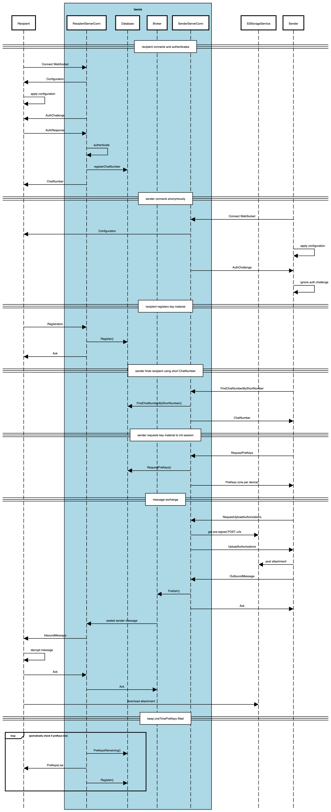

# tassis Documentation

## Table of Contents
- [Overview](#overview)
  - [Key Distribution](#key-distribution)
  - [Message Transport](#message-transport)
- [WebSockets API](#websockets-api)
- [Security](#security)
- [Message Exchange Flow](#message-exchange-flow)
- [Messages](#messages)

## Overview
tassis provides back-end facilities for exchanging end-to-end encryptoed (E2EE) messages between messaging clients. It provides two key facilities:

- Key Distribution
- Message transport

These facilities are access via a [websockets API](#websockets-api)

### Key Distribution
Encryption is handled by clients using the [Signal protocol](https://github.com/signalapp/libsignal-protocol-java).

tassis implements the "server" role as defined in Signal's [Sesame paper](https://www.signal.org/docs/specifications/sesame/).

With Signal, messages are actually exchanged between devices, with each device pair having its own crypto session. So for example, if user A wants to send a message to user B
that can be read on all their devices, user A needs to establish independent sessions with all of user B's devices, independently encrypt the message and send the separate ciphertext to each device.

Each user's device is identified by an [Address](#signal.Address).

Signal clients use the [X3DH key agreement protocol](https://www.signal.org/docs/specifications/x3dh/) to establish encrypted session, which requires server-facilitiated exchange of key information.

tassis is ignorant of Signal's encryption algorithms and simply stores the information for use by Signal's client-side encryption logic as opaque data.

There are two ways that a session can be established:

1. When a device wants to send an encrypted message to a user, it initiates one local session per recipient device. In order to do this, it needs to know the key information for the other devices, which it obtains by sending tassis a [RequestPreKeys](#signal.RequestPreKeys) message and getting back one [PreKey](#signal.PreKey) per known device. With this, it sends a session initiation message that contains all the key material that the recipient needs in order to establish a session on its end.

2. When a device receives an encrypted session initiation message from another device, it sets up the encrypted session on its end without needing to retrieve any key material from tassis.

### Message Transport
tassis facilities the exchange of messages between clients by supporting store-and-forward send and receive of opaque messages between clients. After connecting to tassis, clients can send messages to arbitrary addresses. Connected clients identify their own address upon connecting, at which point they can receive any messages that were sent to them.

#### Message Acknowledgement and Delivery Guarantees
Once clients have durably received a message, they acknowledge this to tassis, which in turn acknowledges receipt of the message to its broker so that the message won't be delivered in the future.

If acknowledgements are lost, messages may be delivered multiple times, so clients need to take care to deduplicate messages on their own end.

#### Message Retention
The messaging server enforces limits on how many messages are retained for each device. If devices do not retrieve messages prior to those limits being hit, messages may be lost in transit.

## Websockets API
The public API uses websockets. Clients open two connections to ws[s]://server/<identityKey>/<deviceId>, one authenticated connection and one unauthenticated connection. To preserve sender anonymity, they retrieve key material and send messages on the unauthenticated connection. All other operations happen on the authenticated connection.

All messages in the context of a client connection have a unique sequence number that identifies the message (separate sequences for both directions).

For all messages, if an error is encountered while processing the message, the server will respond with an [Error](#signal.Error) whose sequence number is set to the sequence number of the message that led to the error.

For messages that require a response (like [RequestPreKeys](#signal.RequestPreKeys)), if there was no error, the remote end will respond the corresponding response messages (like [PreKey](#signal.PreKey)).

For all other messages, the remote end (both client and server) should respond with an [Ack](#signal.Ack) whose sequence number is set to the sequence number of the message that is being acknowledged.

### Configuration Messages
Whenever a client opens a connection, the server immediately sends a Configuration message that informs the client of current configuration parameters like maximum attachment sizes, etc.

## External Dependencies
tassis needs a [database](../db/db.go) for storing key distribution information and a pub/sub [message broker](../broker/broker.go) for exchanging messages between users.

Simple in-memory implementations of both are provided for testing. In production, we'll start with Redis based implementations. If performance of the message transport becomes an issue, we can consider something like  [Apache Pulsar](https://streamnative.io/cloud/hosted).

tassis depends on Redis 6.2+. Currently, 6.2 is still in release candidate status. If tassis runs against an older version of Redis, it won't be able to delete acknowledged messages from the message queues. It will still bound message queues to a maximum length though, so it can be used in this way.

## Security

### Authentication
tassis supports both authenticated and unauthenticated connections. At the beginning of every connection, the server sends an [AuthChallenge](#signal.AuthChallenge) to the client with a nonce. Clients that wish to remain anonymous can simply ignore the challenge. Clients that wish to authenticate respond with an [AuthResponse](#signal.AuthResponse) containing their Address (IdentityKey and DeviceId), the nonce from the challenge, and a signature over the Address+Nonce. The server then verifies that the nonce matches the expected value for this connection and that the signature is correct based on the sender's IdentityKey. If yes, the user is authenticated. If not, the server returns an error and closes the connection.

### Key Distribution
In principle, tassis only provides a convenience for key-distribution, and it's encumbent on clients and end-users to verify key material for themselves. The identityKey is in fact also the public key corresponding to that identity (no key rotation allowed for a given identityKey), so in practice if people are confident that they're sending a message to the correct identityKey, they can be confident that it's being encrypted for reading by the owner of that IdentityKey.

### Transport Security

#### Message Privacy and Integrity
Because clients use E2EE, tassis does not concern itself with protecting the contents of messages from eavesdropping or tampering

#### Sender Anonymity (Sealed Sender)
Sealed Sender is a scheme used by Signal for allowing senders to send messages without intermediaries know who sent the message. The original scheme involved the Signal server issuing a certificate attesting to the sender's identity and the sender encrypting that certificate and sending it to the recipient. Because tassis doesn't use phone numbers, it doesn't need to attest to the sender's identity. So here, the sender simply signs its own address information and encrypts that for transmission to the client. Because the address is encrypted just like with Signal, and clients send messages via unauthenticaated connections, tassis doesn't know the address of the sender, only the recipient. Our Java implementation of this can be found [here](https://github.com/getlantern/libsignal-metadata-java).

#### Denial of Service
Because clients rely on tassis for the actual transport of messages, it is important to guard against various denial of services attacks. In addition to the typical denial of service attacks faced by any web service, tassis guards against the following categories of attack:

##### Message Flooding
Rate limiting should be used to prevent individual clients from flooding the network, or any particular user, with messages. *this is not yet implemented*

##### Message Stealing
In order to prevent unauthorized users from stealing messages before they can be received by their legitimate clients, tassis authenticates clients based on IdentityKey to make sure that only authorized clients may read messages on behalf of a specific user.

## Message Exchange Flow

<!-- The above sequence diagram is generated at https://sequencediagram.org using the below code:

Message Exchange Flow

==recipient connects and authenticates==
participant Recipient
participantgroup #lightblue **tassis**
participant RecipientServerConn
participant Database
participant Broker
participant SenderServerConn
end
participant S3StorageService
participant Sender

Recipient->RecipientServerConn:Connect WebSocket
RecipientServerConn->Recipient:Configuration
Recipient->Recipient:apply configuration
RecipientServerConn->Recipient:AuthChallenge
Recipient->RecipientServerConn:AuthResponse
RecipientServerConn->Recipient:Ack

==sender connects anonymously==
Sender->SenderServerConn:Connect WebSocket
SenderServerConn->Recipient:Configuration
Sender->Sender:apply configuration
SenderServerConn->Sender:AuthChallenge
Sender->Sender:ignore auth challenge

==recipient registers key material==
Recipient->RecipientServerConn:Registration
RecipientServerConn->Database:Register()
RecipientServerConn->Recipient:Ack

==sender requests key material to init session==
Sender->SenderServerConn:RequestPreKeys
SenderServerConn->Database:RequestPreKeys()
SenderServerConn->Sender:PreKeys (one per device)
end

==message exchange==
Sender->SenderServerConn:RequestUploadAuthorizations
SenderServerConn->S3StorageService:get pre-signed POST urls
SenderServerConn->Sender:UploadAuthorizations
Sender->S3StorageService:post attachment
Sender->SenderServerConn:OutboundMessage
SenderServerConn->Broker:Publish()
SenderServerConn->Sender:Ack
Broker->RecipientServerConn:sealed sender message
RecipientServerConn->Recipient:InboundMessage
Recipient->Recipient:decrypt message
Recipient->RecipientServerConn:Ack
RecipientServerConn->Broker:Ack
Recipient->S3StorageService:download attachment
end

==keep oneTimePreKeys filled==
loop periodically check if preKeys low
RecipientServerConn->Database:PreKeysRemaining()
RecipientServerConn->Recipient:PreKeysLow
RecipientServerConn->Database:Register()
end

-->

## Messages

- [model/Messages.proto](#model/Messages.proto)
    - [Ack](#tassis.Ack)
    - [Address](#tassis.Address)
    - [AuthChallenge](#tassis.AuthChallenge)
    - [AuthResponse](#tassis.AuthResponse)
    - [Configuration](#tassis.Configuration)
    - [Error](#tassis.Error)
    - [ForwardedMessage](#tassis.ForwardedMessage)
    - [Login](#tassis.Login)
    - [Message](#tassis.Message)
    - [OutboundMessage](#tassis.OutboundMessage)
    - [PreKey](#tassis.PreKey)
    - [PreKeys](#tassis.PreKeys)
    - [PreKeysLow](#tassis.PreKeysLow)
    - [Register](#tassis.Register)
    - [RequestPreKeys](#tassis.RequestPreKeys)
    - [RequestUploadAuthorizations](#tassis.RequestUploadAuthorizations)
    - [Unregister](#tassis.Unregister)
    - [UploadAuthorization](#tassis.UploadAuthorization)
    - [UploadAuthorization.UploadFormDataEntry](#tassis.UploadAuthorization.UploadFormDataEntry)
    - [UploadAuthorizations](#tassis.UploadAuthorizations)
  
- [Scalar Value Types](#scalar-value-types)

<a href="#top">Top</a>

### model/Messages.proto
tassis uses an asynchronous messaging pattern for interacting with the API.

Clients typically connect to tassis via WebSockets to exchange messages.

Clients will typically open two separate connections, authenticating on one and leaving
the other unauthenticated.

The unauthenticated connection is used for retrieving other identities' preKeys and
sending messages to them, so as not to reveal the identityKey of senders.

The authenticated connection is used for all other operations, including performing key
management and receiving messages from other identities.

Authentication is performed using a challenge-response pattern in which the server sends
an authentication challenge to the client and the client responds with a signed authentication
response identifying its identityKey and deviceId. On anonymous connections, clients simply ignore the
authentication challenge.

Messages sent from clients to servers follow a request/response pattern. The server will always
respond to these with either an Ack or a typed response. In the event of an error, it will respond
with an Error message. This includes the following messages:

 - Register        -> Ack
 - Unregister      -> Ack
 - RequestPreKeys  -> PreKeys
 - OutboundMessage -> Ack

Some messages sent from the server to the client require an Ack in response:

 - inboundMessage  -> Ack

Some messages don't require any response:

 - PreKeysLow

All messages sent within a given connection are identified by a unique sequence number (separate sequences
for each direction). When a response message is sent in either direction, its sequence number is set to the
message that triggered the response so that the client or server can correlate responses with requests.

#### Ack
Acknowledges successful receipt of a Message

#### Address
An Address for a specific client

| Field | Type | Label | Description |
| ----- | ---- | ----- | ----------- |
| identityKey | [bytes](#bytes) |  | The 32 byte ed25519 public key that uniquely identifies an identity (e.g. a user) |
| deviceId | [bytes](#bytes) |  | Identifier for a specific device, only unique for a given identityKey |

#### AuthChallenge
A challenge to the client to authenticate. This is sent by the server once and only once, immediately after clients connect.

| Field | Type | Label | Description |
| ----- | ---- | ----- | ----------- |
| nonce | [bytes](#bytes) |  | A nonce to identify this authentication exchange |

#### AuthResponse
A response to an AuthChallenge that is sent from the client to the server on any connection that the client wishes to authenticate.
The server will accept an AuthResponse only once per connection.

| Field | Type | Label | Description |
| ----- | ---- | ----- | ----------- |
| login | [bytes](#bytes) |  | The serialized form of the Login message |
| signature | [bytes](#bytes) |  | A signature of the serialized Login message calculated using the private key corresponding to the IdentityKey that's logging in |

#### Configuration
Provides configuration information to clients

| Field | Type | Label | Description |
| ----- | ---- | ----- | ----------- |
| maxAttachmentSize | [int64](#int64) |  | The maxmimum allows attachment size (encrypted size, not plaintext) |

#### Error
Indicates than an error occurred processing a request.

| Field | Type | Label | Description |
| ----- | ---- | ----- | ----------- |
| name | [string](#string) |  | An identifier for the error, like "unknown_identity" |
| description | [string](#string) |  | Optional additional information about the error |

#### ForwardedMessage
Used internally by tassis for messages that are to be forwarded to a federated tassis

| Field | Type | Label | Description |
| ----- | ---- | ----- | ----------- |
| message | [OutboundMessage](#tassis.OutboundMessage) |  | The message that's being forwarded |
| firstFailed | [int64](#int64) |  | The unix timestamp in milliseconds for when the message first failed to forward |
| lastFailed | [int64](#int64) |  | The unix timestamp in milliseconds for when the message most recently failed to forward |

#### Login
Login information supplied by clients in response to an AuthChallenge.

| Field | Type | Label | Description |
| ----- | ---- | ----- | ----------- |
| address | [Address](#tassis.Address) |  | The Address that's logging in. This will become permanently associated with the current connection |
| nonce | [bytes](#bytes) |  | This echoes back the nonce provided by the server in the AuthChallenge |

#### Message
The envelope for all messages sent to/from clients.

| Field | Type | Label | Description |
| ----- | ---- | ----- | ----------- |
| sequence | [uint32](#uint32) |  | the message sequence, either a unique number for request messages or the number of the request message to which a response message corresponds |
| ack | [Ack](#tassis.Ack) |  |  |
| error | [Error](#tassis.Error) |  |  |
| configuration | [Configuration](#tassis.Configuration) |  |  |
| authChallenge | [AuthChallenge](#tassis.AuthChallenge) |  |  |
| authResponse | [AuthResponse](#tassis.AuthResponse) |  |  |
| register | [Register](#tassis.Register) |  |  |
| unregister | [Unregister](#tassis.Unregister) |  |  |
| requestPreKeys | [RequestPreKeys](#tassis.RequestPreKeys) |  |  |
| preKeys | [PreKeys](#tassis.PreKeys) |  |  |
| preKeysLow | [PreKeysLow](#tassis.PreKeysLow) |  |  |
| requestUploadAuthorizations | [RequestUploadAuthorizations](#tassis.RequestUploadAuthorizations) |  |  |
| uploadAuthorizations | [UploadAuthorizations](#tassis.UploadAuthorizations) |  |  |
| outboundMessage | [OutboundMessage](#tassis.OutboundMessage) |  |  |
| inboundMessage | [bytes](#bytes) |  |  |

#### OutboundMessage
Requires anonymous connection

A message from one client to another.

| Field | Type | Label | Description |
| ----- | ---- | ----- | ----------- |
| to | [Address](#tassis.Address) |  | The Address of the message recipient |
| unidentifiedSenderMessage | [bytes](#bytes) |  | A sealed sender message (opaque to tassis). This is what will be delivered to the recipient. |

#### PreKey
Information about a PreKey for a specific Address.

| Field | Type | Label | Description |
| ----- | ---- | ----- | ----------- |
| deviceId | [bytes](#bytes) |  | The deviceId that this key material belongs to |
| signedPreKey | [bytes](#bytes) |  | The most recent signedPreKey for the device at this Address. See https://crypto.stackexchange.com/questions/72148/signal-protocol-how-is-signed-preKey-created |
| oneTimePreKey | [bytes](#bytes) |  | One disposable preKey for the device at this Address. May be empty if none were available (that's okay, Signal can still do an X3DH key agreement without it). |

#### PreKeys
A list of PreKeys for all of an identityKey's devices, sent in response to RequestPreKeys

| Field | Type | Label | Description |
| ----- | ---- | ----- | ----------- |
| preKeys | [PreKey](#tassis.PreKey) | repeated | One or more preKeys |

#### PreKeysLow
A notification from the server to the client that we're running low on oneTimePreKeys for the Address associated to this connection.

Clients may choose to respond to this by sending a Register message with some more preKeys. This does not have to be tied to the initial PreKeysLow message.

| Field | Type | Label | Description |
| ----- | ---- | ----- | ----------- |
| keysRequested | [uint32](#uint32) |  | The number of additional oneTimePreKeys that the server is requesting. |

#### Register
Requires authentication

A request to register a signed preKey and some set of one-time use preKeys. PreKeys are used by clients to perform X3DH key agreement in order to
establish end-to-end encrypted sessions.

This information is registered in the database under the client's Address. If multiple registrations are received, if signedPreKey matches the
information on file, the new preKeys will be appended to the ones already on file. Otherwise, the existing registration will be replaced by the
latest.

| Field | Type | Label | Description |
| ----- | ---- | ----- | ----------- |
| signedPreKey | [bytes](#bytes) |  | The signedPreKey for this device. |
| oneTimePreKeys | [bytes](#bytes) | repeated | Zero, one or more disposable preKeys for this device. |

#### RequestPreKeys
Requires anonymous connection

A request to retrieve preKey information for all registered devices for the given identityKey except those listed in knownDeviceIds.

| Field | Type | Label | Description |
| ----- | ---- | ----- | ----------- |
| identityKey | [bytes](#bytes) |  | The identityKey for which to retrieve preKeys. |
| knownDeviceIds | [bytes](#bytes) | repeated | Devices of this identity which the client already knows about and doesn't need preKeys for. |

#### RequestUploadAuthorizations
Requests attachment upload authorizations.

| Field | Type | Label | Description |
| ----- | ---- | ----- | ----------- |
| numRequested | [int32](#int32) |  | the number of authorizations requested. The server may not return the number requested. |

#### Unregister
Requires authentication

Removes the recorded registration for the client's Address.

#### UploadAuthorization
Provides authorization to upload an attachment to cloud storage

| Field | Type | Label | Description |
| ----- | ---- | ----- | ----------- |
| uploadURL | [string](#string) |  | The URL to which to upload |
| uploadFormData | [UploadAuthorization.UploadFormDataEntry](#tassis.UploadAuthorization.UploadFormDataEntry) | repeated | This form data needs to be included with the upload in order to authorize it |
| authorizationExpiresAt | [int64](#int64) |  | The unix timestamp in milliseconds when this authorization expires and can no longer be used |
| maxUploadSize | [int64](#int64) |  | The maxmimum number of bytes that are allowed to be uploaded |
| downloadURL | [string](#string) |  | The URL from which the attachment may be downloaded once it has been uploaded |

#### UploadAuthorization.UploadFormDataEntry

| Field | Type | Label | Description |
| ----- | ---- | ----- | ----------- |
| key | [string](#string) |  |  |
| value | [string](#string) |  |  |

#### UploadAuthorizations
Multiple UploadAuthorizations

| Field | Type | Label | Description |
| ----- | ---- | ----- | ----------- |
| authorizations | [UploadAuthorization](#tassis.UploadAuthorization) | repeated |  |

 <!-- end messages -->

 <!-- end enums -->

 <!-- end HasExtensions -->

 <!-- end services -->

### Scalar Value Types

| .proto Type | Notes | C++ | Java | Python | Go | C# | PHP | Ruby |
| ----------- | ----- | --- | ---- | ------ | -- | -- | --- | ---- |
| <a name="double" /> double |  | double | double | float | float64 | double | float | Float |
| <a name="float" /> float |  | float | float | float | float32 | float | float | Float |
| <a name="int32" /> int32 | Uses variable-length encoding. Inefficient for encoding negative numbers – if your field is likely to have negative values, use sint32 instead. | int32 | int | int | int32 | int | integer | Bignum or Fixnum (as required) |
| <a name="int64" /> int64 | Uses variable-length encoding. Inefficient for encoding negative numbers – if your field is likely to have negative values, use sint64 instead. | int64 | long | int/long | int64 | long | integer/string | Bignum |
| <a name="uint32" /> uint32 | Uses variable-length encoding. | uint32 | int | int/long | uint32 | uint | integer | Bignum or Fixnum (as required) |
| <a name="uint64" /> uint64 | Uses variable-length encoding. | uint64 | long | int/long | uint64 | ulong | integer/string | Bignum or Fixnum (as required) |
| <a name="sint32" /> sint32 | Uses variable-length encoding. Signed int value. These more efficiently encode negative numbers than regular int32s. | int32 | int | int | int32 | int | integer | Bignum or Fixnum (as required) |
| <a name="sint64" /> sint64 | Uses variable-length encoding. Signed int value. These more efficiently encode negative numbers than regular int64s. | int64 | long | int/long | int64 | long | integer/string | Bignum |
| <a name="fixed32" /> fixed32 | Always four bytes. More efficient than uint32 if values are often greater than 2^28. | uint32 | int | int | uint32 | uint | integer | Bignum or Fixnum (as required) |
| <a name="fixed64" /> fixed64 | Always eight bytes. More efficient than uint64 if values are often greater than 2^56. | uint64 | long | int/long | uint64 | ulong | integer/string | Bignum |
| <a name="sfixed32" /> sfixed32 | Always four bytes. | int32 | int | int | int32 | int | integer | Bignum or Fixnum (as required) |
| <a name="sfixed64" /> sfixed64 | Always eight bytes. | int64 | long | int/long | int64 | long | integer/string | Bignum |
| <a name="bool" /> bool |  | bool | boolean | boolean | bool | bool | boolean | TrueClass/FalseClass |
| <a name="string" /> string | A string must always contain UTF-8 encoded or 7-bit ASCII text. | string | String | str/unicode | string | string | string | String (UTF-8) |
| <a name="bytes" /> bytes | May contain any arbitrary sequence of bytes. | string | ByteString | str | []byte | ByteString | string | String (ASCII-8BIT) |
